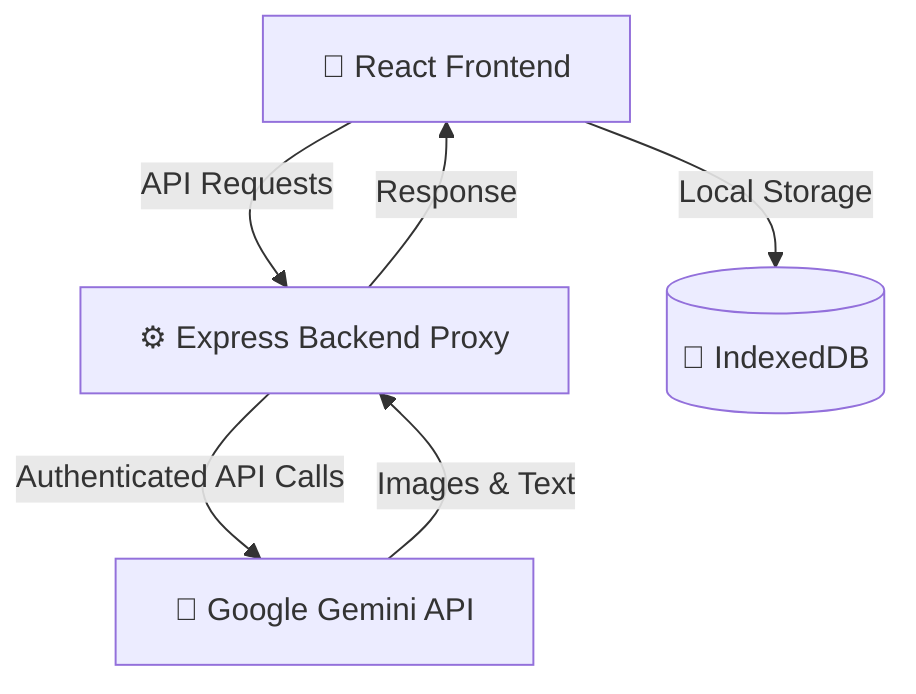

# 💇‍♀️ Hairstyle AI Studio


## 🌟 The Pitch: Visualize Your New Look Before the Scissors Touch Your Hair!

Choosing a new hairstyle is a major decision. Will it suit your face shape? Will the color match your skin tone? **Hairstyle AI Studio** takes the guesswork out of the salon experience.

Using Google's cutting-edge **Gemini 3.1 and Pro image generation models**, our application lets you visualize realistic makeovers instantly. Simply upload front, side, and back photos, select from curated modern styles (like the *Holographic Shag* or *Modern Mullet*), or write a custom description. The models will apply the style flawlessly while **exactly preserving your facial identity, facial structure, skin tone, and expression**.

---

## ✨ Highlights

- **🔒 Express Server-Side API Proxy**: Protects your environment by routing all Gemini requests through a secure Node.js backend (`server/server.js`). This prevents exposing your API keys to the browser bundle.
- **🛡️ Robust Rate-Limiting**: Built-in rate limits protect your Gemini API quota and budget.
- **🚀 Gemini 3.1 Image Workflow**: Fast Preview, Studio Quality, and Pro / 4K modes.
- **📐 Flexible Result Layouts**: Supports Single Reveal, Salon Sheet, and Before / After comparisons.
- **🕵️‍♀️ Privacy-First Local History**: User reference and generated images are saved locally in the browser's IndexedDB, ensuring privacy.
- **🐳 Simple Docker Containerization**: Packaged with a production-ready, lightweight Docker image.

## 🏗️ Architecture



## 🛠️ Tech Stack

- **Frontend**: React 19, Vite, TypeScript, Tailwind CSS, Lucide React
- **Backend API Proxy**: Express, Rate Limiters, `@google/genai` (Google Gen AI SDK)
- **Containerization**: Docker

## 🧠 Gemini Models

Model constants are centrally managed in `app/services/geminiModels.ts`:

| UX Mode | Model Name | Use Case |
| --- | --- | --- |
| **⚡ Fast Preview** | `gemini-3.1-flash-image` | Fast, lightweight preview generations |
| **📸 Studio Quality** | `gemini-3.1-flash-image` | Production-grade high-fidelity hairstyles |
| **💎 Pro / 4K** | `gemini-3-pro-image` | Premium, ultra-detailed style rendering |

> [!NOTE]
> Text-based styling suggestions and title summarization utilize `gemini-3.1-flash-lite`.

---

## 💻 Local Development & Running Instructions

You can run Hairstyle AI Studio locally in three modes:

### Option A: Local Dev Server + Local Express API Proxy (Recommended)
Runs the Vite hot-reloading dev server for frontend development while proxying API calls to the local Express server.

1. **Install dependencies**:
   ```bash
   npm install
   ```
2. **Set up Environment Variables**:
   ```bash
   cp .env.example .env
   ```
   Edit `.env` and set:
   ```env
   GEMINI_API_KEY=your_actual_gemini_api_key
   VITE_USE_PROXY=true
   ```
3. **Start the Express API Proxy Server**:
   ```bash
   node server/server.js
   ```
   *(Runs on port 3001)*
4. **Start the Vite Dev Server (in a separate terminal)**:
   ```bash
   npm run dev
   ```
   *(Runs on port 3000, proxying `/api` requests to port 3001)*
5. Open your browser to `http://localhost:3000`.

### Option B: Local Direct Browser Calls (No Proxy)
For quick prototyping without running a local backend server:
1. Set `VITE_GEMINI_API_KEY=your_key` in `.env` (ensure `VITE_USE_PROXY` is unset or `false`).
2. Run `npm run dev` and open `http://localhost:3000`.

> [!WARNING]
> **Important**: Do not use this method in public staging or production, as the API key is bundled into the client files and visible to users.

### Option C: Run the Unified Production Build Locally
To test exactly what will be deployed in production:
1. Build the production assets:
   ```bash
   npm run build
   ```
2. Start the server (ensure `GEMINI_API_KEY` is set):
   ```bash
   GEMINI_API_KEY=your_key node server/server.js
   ```
3. Open `http://localhost:3001`. The Express server serves the frontend static build from `dist/` and runs the secure proxy.

---

## 🐳 Simple Docker Deployment

The application includes a `Dockerfile` for single-command production containerization.

### 1. Build the Docker Image
```bash
docker build -t hairstyle-ai-studio .
```

### 2. Run the Container Securely
Pass your `GEMINI_API_KEY` at runtime. Do **not** bake keys into the image.
```bash
docker run -d \
  -p 8080:8080 \
  -e GEMINI_API_KEY="your_production_gemini_key" \
  --name hairstyle-studio \
  hairstyle-ai-studio
```
The app will be accessible at `http://localhost:8080`.

---

## ☁️ Google Cloud Run Deployment

Deploy directly to Google Cloud Run from source:

```bash
gcloud run deploy hairstyle-studio \
  --source . \
  --port 8080 \
  --set-env-vars="GEMINI_API_KEY=your_gemini_api_key" \
  --allow-unauthenticated
```
*(See `DEPLOYMENT.md` for more details)*

---

## 🔒 Secure Release & Deployment Instructions

To ensure a secure release, follow these guidelines:

1. **API Key Security**:
   - **Never** expose `VITE_GEMINI_API_KEY` in production deployments.
   - Inject the production key as the `GEMINI_API_KEY` environment variable in your target environment.
   - Use secrets management services to store the key.
2. **Rate Limits & CORS**:
   - The Express proxy server has pre-configured rate limiters (`express-rate-limit`). Adjust CORS settings in `server/server.js` from `origin: '*'` to your specific production domains.
3. **Build Validation**:
   - Always run the validation command before tagging or publishing a release:
     ```bash
     npm run check
     ```

---

## 📜 Scripts

```bash
npm run dev        # start local Vite dev server
npm run typecheck  # validate TypeScript types
npm run build      # compile production build assets
npm run preview    # preview the local production build
npm run check      # validate types + compile production build
```

## 🛡️ Privacy & Safety

- User reference photos are sent to Gemini only for hairstyle visualization and are not stored by the application server.
- The history of generated makeovers is stored locally in the browser's IndexedDB.
- Clear history controls are provided in the settings.

## 📄 License

MIT
