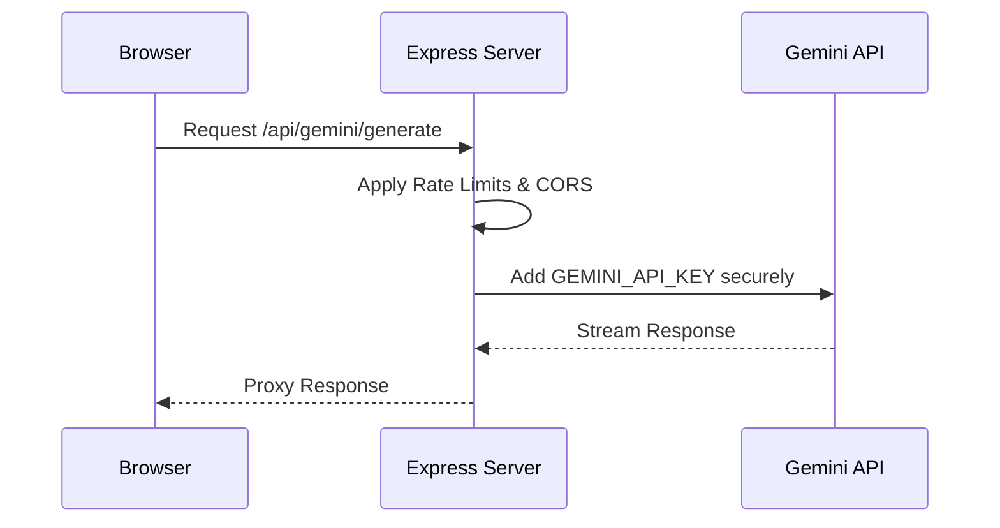

# 🚀 Deployment Guide — Hairstyle AI Studio

This guide outlines the production deployment architectures, configuration requirements, and security best practices for running Hairstyle AI Studio in a production environment.

---

## 🏗️ Production Architecture: Secure Express API Proxy

Hairstyle AI Studio includes a built-in Node.js Express server (`server/server.js`) that acts as a secure server-side API proxy. This architecture prevents the exposure of the `GEMINI_API_KEY` in the client-side JavaScript bundle.



- **Routing Flow**: The browser client sends image payloads and style instructions directly to the relative endpoints (e.g. `/api/gemini/generate`). The Express proxy server reads the secure `GEMINI_API_KEY` environment variable, attaches it, and performs the request to Google Gemini API on the server side.
- **Static Assets**: The same Express server serves the pre-compiled client-side React code from the `dist/` directory, acting as a single, unified service.

---

## 🔐 Environment Variables

Configure these variables in your target hosting platform:

| Variable | Scope | Purpose | Security Requirement |
| --- | --- | --- | --- |
| `GEMINI_API_KEY` | Server-Side Only | The production API key for Google Gemini image and text models. | **CRITICAL**: Store in a secure secrets manager. Never expose to client bundles. |
| `PORT` | Server-Side Only | The port the Express application binds to (default: `3001`). | Required for virtual servers or cloud containers. |
| `NODE_ENV` | Server-Side Only | Should be set to `production`. | Optimizes performance and controls logging. |
| `VITE_USE_PROXY` | Client-Side (Dev) | Tells the React application to send requests to `/api/...` proxy routes. | Unnecessary in production (enabled by default when `import.meta.env.PROD` is true). |
| `VITE_GEMINI_API_KEY` | Client-Side Only | Direct API key configuration. | **Do not use in production.** Set only for local/private standalone client demos. |

---

## 🐳 Docker Deployment (Recommended)

The simplest and most secure way to deploy Hairstyle AI Studio is using the provided `Dockerfile`.

### 1. Build the Docker Image
Run this command from the root of the repository:
```bash
docker build -t hairstyle-ai-studio:latest .
```

### 2. Run the Container
Instantiate the container, passing the secret key securely through environment injection:
```bash
docker run -d \
  --name hairstyle-studio \
  -p 3001:3001 \
  -e GEMINI_API_KEY="your_production_gemini_api_key" \
  -e NODE_ENV="production" \
  hairstyle-ai-studio:latest
```

---

## ✅ Secure Production Checklist

Before releasing public versions of Hairstyle AI Studio, ensure you complete the following steps:

> [!CAUTION]
> **Verify Secret Separation**: Check that `VITE_GEMINI_API_KEY` is not present in your production environment or built bundle. Inspect network requests in the browser console during generation to confirm that no API keys are transmitted from the browser. All requests should target `/api/gemini/*` endpoints on the host server.

1. **Restrict CORS Origins**:
   - In `server/server.js`, locate the CORS configuration:
     ```javascript
     app.use(cors({
       origin: '*', // CHANGE THIS FOR PRODUCTION
       methods: ['GET', 'POST', 'OPTIONS'],
       allowedHeaders: ['Content-Type', 'Authorization']
     }));
     ```
   - Change `origin: '*'` to your specific app domain to prevent other domains from making API calls through your proxy server.
2. **Configure Rate Limits**:
   - The Express proxy utilizes `express-rate-limit` to protect your billing from abuse. Adjust these values in `server/server.js` based on your project's scaling and budget requirements.
3. **Trust Proxy Headers**:
   - If hosting behind a load balancer or reverse proxy, verify `app.set('trust proxy', 1)` is enabled in `server/server.js` so that rate-limiting correctly identifies the user's client IP.
4. **Run Compilation & Validation**:
   - Execute the check script to run full TypeScript compilation and Vite build checks before deployment:
     ```bash
     npm run check
     ```
