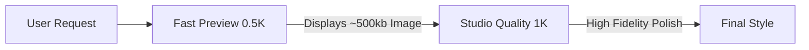

# 🧠 Gemini Models API Integration Documentation

This document explains how the Hairstyle AI Studio application integrates with the standard Google Gemini **Models API** via the `@google/genai` SDK. It details the workflow for image generation, progressive loading, and why standard Models API calls are preferred for browser-side SPA environments.

---

## 🌐 CORS Compatibility in a Client-Side SPA

The application uses standard `models.generateContent` and `models.generateContentStream` API calls from `@google/genai`. 

> [!TIP]
> **Why standard Models API?** Older orchestrator-style APIs can have distinct endpoint architectures that trigger CORS preflight restrictions on browser-side calls from client environments. By using the standard Models API endpoints, the application ensures direct browser-to-Gemini compatibility when building client-side prototypes or utilizing local development servers.

> [!IMPORTANT]
> **Production Security Reminder:** While direct client-side calls are convenient for local development with `VITE_GEMINI_API_KEY`, production deployments should **always** route these API calls through a secure server-side/API gateway proxy (like the provided `server/server.js`) to keep the API key secret.

---

## 🤖 Canonical Models Used

Models are defined centrally in `services/geminiModels.ts`:

* **Text & Analysis Tasks**: `gemini-3.1-flash-lite`
* **Fast Image Preview Generation**: `gemini-3.1-flash-image`
* **Studio Quality Image Generation**: `gemini-3.1-flash-image`
* **Premium Quality Generation**: `gemini-3-pro-image`

---

## ⚡ Image Generation & Progressive Load Workflow

To optimize load times and keep the user interface highly interactive, the app implements a progressive image workflow:



1. **Fast Preview (0.5K / 500kb progressive load)**
   * Uses `gemini-3.1-flash-image` configured with a smaller image size representing the 0.5K stage.
   * Fast execution speed provides near-instant visual feedback.
   * Delivers a lightweight progressive load, saving bandwidth and rendering fast in mobile environments.
2. **Studio Quality (1K resolution)**
   * Uses `gemini-3.1-flash-image` or `gemini-3-pro-image` configured with an image size of `1K`.
   * High fidelity and editorial detailing for final styling/makeover results.

---

## 💻 Core API Integration Patterns

### 1. Text & Vision Generation (`models.generateContent`)

Used for catchy title summaries, image recommendations, and trending hairstyle suggestions.

```typescript
const ai = new GoogleGenAI({ apiKey });
const response = await ai.models.generateContent({
  model: 'gemini-3.1-flash',
  contents: promptText,
  config: {
    thinkingConfig: { thinkingBudget: 0 },
    responseMimeType: 'text/plain',
  }
});
```

For vision-based gender recommendation and style recommendation, we pass the image parts directly in the `contents` array:

```typescript
const response = await ai.models.generateContent({
  model: 'gemini-3.1-flash',
  contents: [
    {
      inlineData: {
        mimeType: 'image/jpeg',
        data: base64DataString
      }
    },
    { text: promptInstruction }
  ],
  config: {
    responseMimeType: 'application/json',
  }
});
```

### 2. Streaming Image Generation (`models.generateContentStream`)

For image generation and refinement, the app streams candidates to capture the inline thoughts (`part.thought`) and the resulting base64 image data:

```typescript
const stream = await ai.models.generateContentStream({
  model: 'gemini-3.1-flash-image',
  contents: parts,
  config: {
    imageConfig: {
      aspectRatio: '16:9',
      imageSize: '512' // '512' represents 0.5K, or '1K'
    }
  }
});

for await (const chunk of stream) {
  for (const part of chunk.candidates?.[0]?.content?.parts || []) {
    if (part.thought && onThinking) {
      onThinking(part.text || '');
    }
    if (part.inlineData) {
      finalImageProp = part.inlineData;
    }
  }
}
```

---

## 🧪 Unit Testing & Mocking with Vitest

Unit tests are written using **Vitest** in `services/__tests__/geminiService.test.ts`.

### Mocking the SDK
Because the SDK is imported and instantiated via `new GoogleGenAI()`, the class and its models methods are mocked globally before importing the service:

```typescript
const mockGenerateContent = vi.fn();
const mockGenerateContentStream = vi.fn();

vi.mock('@google/genai', async (importOriginal) => {
  const original = await importOriginal<typeof import('@google/genai')>();
  return {
    ...original,
    GoogleGenAI: vi.fn().mockImplementation(function () {
      return {
        models: {
          generateContent: mockGenerateContent,
          generateContentStream: mockGenerateContentStream
        }
      };
    })
  };
});
```

### Mocking Stream Generators
To mock the async iterable stream returned by the image generation API, we define an async generator function `async function* ()` yielding candidates:

```typescript
const mockStream = async function* () {
  yield {
    candidates: [
      {
        content: {
          parts: [{ thought: true, text: 'Applying hairstyle' }]
        }
      }
    ]
  };
  yield {
    candidates: [
      {
        content: {
          parts: [{ inlineData: { mimeType: 'image/png', data: 'transformed_data' } }]
        }
      }
    ]
  };
};

mockGenerateContentStream.mockResolvedValue(mockStream());
```
